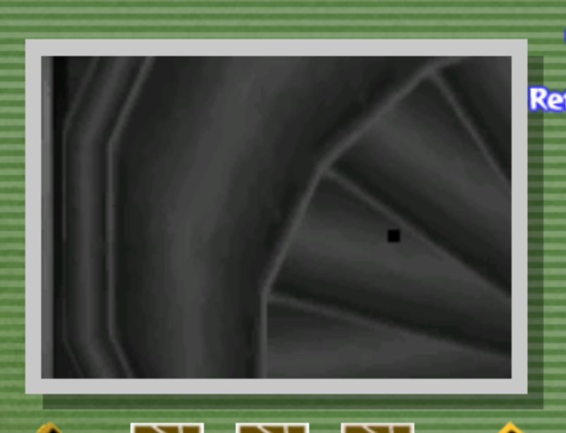
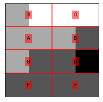

# ACE Techinical explanation:

---

## Part 1: Text Delay

This is a glitch that delays activating an NPCs textbox by storing a textbox and having the NPC offscreen. The text won't be generated until we look at the NPC.  

**How to perform the glitch:**

1. Get storage  
2. Pull out the pictobox nearby an NPC  
3. Switch to gallery mode  
4. Switch back to camera mode, but press **B** while the transition is occuring, this gives Link a few frames to move around and interact with the NPC, and while the pictobox is open, no textboxes from NPCs can be created.  
   - Talk to NPC while the camera is transitioning to camera mode, switch back to gallery mode immediately to keep the pictobox open  
   - Switch back to camera mode, press **B** again to be able to walk away from the NPC.  
   - Repeat switching back and forth until the actor is offscreen.  
5. With the NPC culled (offscreen), they will wait until we rotate the camera back onto them  
   a. Once the text is loaded, we can prevent the text prompts from appearing by simply looking away from the actor again.  

---

## Part 2: Text Stacking

Normally it is impossible to have more than one text box active at a time. But we can get around this by activating text delay on two actors.  

**How to perform the glitch:**

1. Perform text delay on an NPC  
2. Perform text delay on another NPC, ensuring we don't put the 1st NPC back on screen at any point, otherwise their text will load  
3. With both instances of text delay active, we rotate the camera (or use the pictobox) to make sure both actors uncull (get on screen) on the SAME frame  

We now have two textboxes on screen, one of the text boxes graphics are invisible, but we can still advance and close the text at will.  

---

## Part 3: Corrupting the screen data

When a textbox is created normally, the NPC is assigned a pointer **```sScreen```**. ```sScreen``` is a globally static variable that tells the NPC where the screen data for a textbox is loaded into memory.  
The game never expects more than one textbox to ever be loaded at a time, and never anticipated a need to use more than one ```sScreen``` pointer.  
After performing text stacking, this means that both NPCs now believe that the their own textboxes are in the EXACT same place in memory.  

**This can be exploited...**

1. Look at one (and ONLY one) of the NPCs to uncull the text prompts to be able to close the text box.  
2. Once the final text box of the first NPCs has completed, this is what happens:  
   - The NPC sees the final text prompt has been closed and requests to delete the textbox by doing the following:  
      1. The NPC calls the a function, ```dMsg_Delete```, that will handle deleting the textbox.  
      2. ```sScreen``` tells ```dMsg_Delete``` that it needs to run code at whatever value ```sScreen``` is +8 in order to actually delete the screen from memory.  
         For example:  
            - when the message was created, let's say it assigned the value of ```0x81572C40``` to ```sScreen```  
            - ```dMsg_Delete``` looks to see what value is stored by ```sScreen``` at address ```0x81572C40``` and sees the value is 0x8039D680  
            - ```dMsg_Delete``` will attempt to take the address 0x8039D680, add 8 to it, giving us 0x8039D688, and will attempt to run whatever code is located at 0x8039D688  
      3. ```dMsg_Delete``` runs the code ```sScreen``` told it to, and the space that was occupied by that screen is now free to be used by other UI (user interface) elements.  
      4. CRUICIALLY: despite the memory for the screen now available in memory, ```sScreen``` is NOT cleared, and still points to the same location of (now free) memory.  
         Relating back to our example... ```sScreen``` would still have the value ```0x81572C40``` despite that region of memory now available to be overwritten.  
3. With the first text box deleted, we look at the 2nd NPC to start loading in the text prompts (despite them being invisible).  
4. We advance through the text of the 2nd NPC until we get to the final textbox, and make sure the final text prompt icon is visible.  
5. We look away from the 2nd NPC and close the final textbox. Because this NPC is offscreen, it will wait to call the deletion code until it goes back on screen.  
6. We position the camera in a certain way such that when we pull out the pictobox, the NPC unculls the same time the pictobox data loads in  
7. The pictobox UI (user interface) data loads into the now freed space in memory that just got cleared earlier from the 1st NPC.  
   a.) ```sScreen``` is still pointing to the same place in memory, but instead of pointing to screen data, it now points to (seemingly random) data from the pictobox.  
8. The 2nd NPC will attempt to go through the same process as what occurred at step #2. However, this time, ```sScreen``` has been corrupted by pictobox data, and will immediately cause a crash when it tries to run code at an invalid location in memory.  

Unless we do the following......  

---

## Part 4: Creating the payload

Relating back to our example, we mentioned that ```sScreen``` is refering to the address ```0x81572C40```. Originally, ```0x81572C40``` stored information about the (now deleted) textboxes screen data. However, now it's being populated by pictobox data. But what pictobox data exactly is getting loading into that address?  

It just so happens to be a certain collection of pixels within the 3rd image saved in the pictobox.  

>  <br/><br/> *3rd saved image of pictobox. The black pixel is where the data that ```sScreen``` will be replaced with.*  

These pixels represent brightness/darkness levels of that particular region in the image.  
To trigger ACE, the following needs to happen:

1.  The pixel data just so happens to form an address, ```0x80ABBDFF```
   >  <br/><br/> *Read as Left to Right, Top to Bottom to form ```0x80ABBDFF```
2. The game will try to run code at whatever value is stored at 0x80ABBDFF + 8 = ```0x80ABBE07```
3. ```0x80ABBE07``` just so happens to refer to 4th byte of Link's position data.  
4. Link's position data is stored as 3 floating point numbers. Our goal is stand at X position = -200046.0 and Y position = 0.559514701  
   - If we convert these values to hexadecimal we get the following:  
      >| 1  | 2  | 3  | **4**  | **5**  | **6**  | **7**  | 8  |
      >|----|----|----|----|----|----|----|----|
      >| C8 | 43 | 5B | **80** | **3F** | **0F** | **3C** | 5B |
   - We take the 4th byte of the X value and the first 3 bytes of the Y value to get value 80 3F 0F 3C -> 0x803F0F3C
5. The game will attempt to run code at whatever is stored at ```0x803F0F3C``. This address contains controller data for controllers 2-4  
6. We hold very precise inputs on controllers 2-4 to produce machine code which the game will execute.  
   a.) The code is very simple, all it does is delete one line of code that prevents the credits from loading when you load a new stage. This means that the next time we enter a new stage, such as entering Orca's house the credits are immediately triggered  

---

## Part 5: Triggering ACE

To put it all together, the following happens to trigger ACE.  
We peform all the of the steps from Part 3, but now with our payload from the pictobox in place. This means that instead of crashing when ```dMsg_Delete``` tries to run on the stale ```sScreen``` value, the following happens:

1. ```sScreen``` has been corrupted to have the value of 0x80ABBDFF, which is the value of the specific pixel data of the 3rd image of the pictobox.  
2. ```dMsg_Delete``` will take that address and add 8 to it, giving us ```0x80ABBE07```  
3. ```0x80ABBE07``` refers to the 4th byte of Link's position data. Link is standing at X position = -200046.0 and Y position = 0.559514701. Forming the value 0x803F0F3C  
4. ```dMsg_Delete``` will try to run code at address 0x803F0F3C which it now thinks is where it needs to go to delete the screen data, but in reality ends up being the controller data containing our payload.  
5. The controller data is ran as code, deleting one line of code within the stage transition function to trigger the credits.  
6. We load a new stage, the modified code within the stage transition function causes the credits to now load.  
